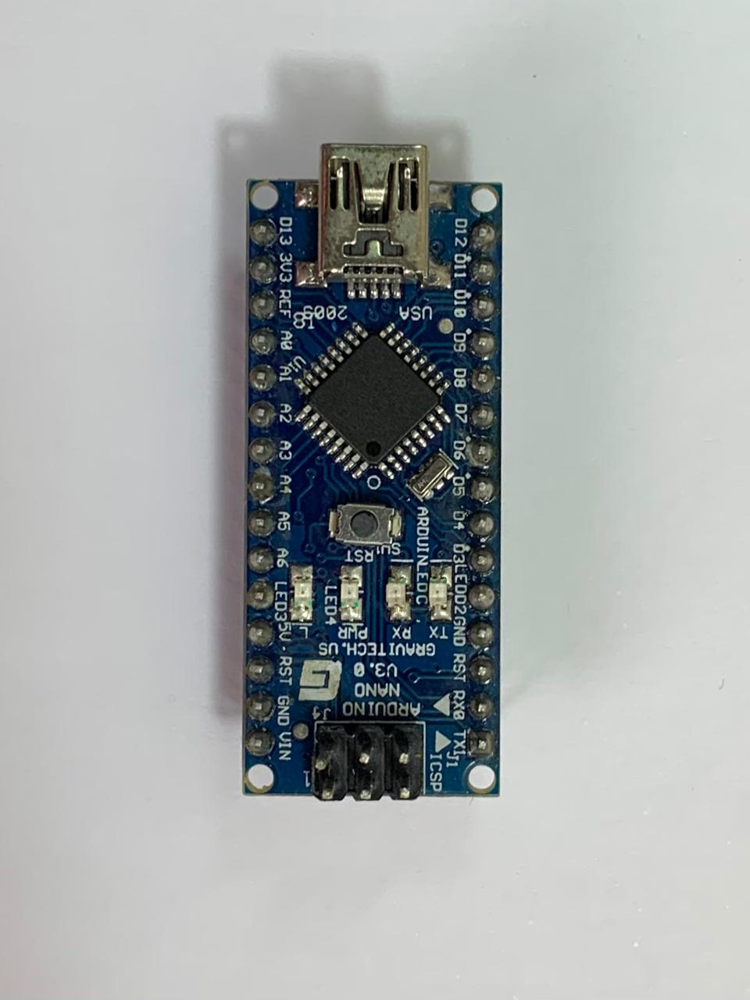

# 00 - Linux Setup

This section explains the Linux toolchain used to build and upload AVR assembly programs for the ATmega328P which is used in the Arduino Nano / Uno / PRO Mini.

I'm using the Arduino Nano, yes mine is a clone but it doesn't matter much for our use case.
\



This project is primarily developed and tested on Ubuntu Linux. But I will add Windows and Mac documentation in the future.


The basic workflow is:

```text
.S assembly source
        ↓
.elf executable file
        ↓
.hex uploadable file
        ↓
Arduino Nano flash memory
```

## Tools used

This project uses:

- `avr-gcc` - builds AVR programs
- `avr-objcopy` - converts ELF files into HEX files
- `avr-objdump` - shows disassembly
- `avrdude` - uploads the HEX file to the Arduino Nano
- `make` - automates the build and upload commands

## Install the toolchain

On Debian/Ubuntu-based systems:

```bash
sudo apt update
sudo apt install gcc-avr binutils-avr avr-libc avrdude make
```

## Finding the Arduino port

Plug in the Arduino Nano and run:

```bash
ls /dev/ttyUSB* /dev/ttyACM* 2>/dev/null
```

Common ports are:

```text
/dev/ttyUSB0
/dev/ttyACM0
```

Most Arduino Nano clones appear as `/dev/ttyUSB0`.

## Fixing permission errors

If you get a permission error while uploading, add your user to the `dialout` group:

```bash
sudo usermod -aG dialout $USER
```

Then log out and log back in.

You can check your groups with:

```bash
groups
```

You should see `dialout` listed.

## Arduino Nano baud rate

Most newer Arduino Nano bootloaders use:

```make
BAUD = 115200
```

Some older Nano bootloaders use:

```make
BAUD = 57600
```

Mine uses 115200 BUAD, but yours might be different.

If upload fails, try:

```bash
make upload BAUD=57600
```

## Common commands

Build the project:

```bash
make
```

Upload to the Arduino Nano:

```bash
make upload
```

Show the disassembly:

```bash
make disasm
```

Clean generated files:

```bash
make clean
```

## Overriding Makefile settings

You can override Makefile variables from the terminal.

Different port:

```bash
make upload PORT=/dev/ttyACM0
```

Old Nano bootloader:

```bash
make upload BAUD=57600
```

Different source file:

```bash
make upload TARGET=buttonblink
```

If `TARGET=buttonblink`, the Makefile expects the source file to be named:

```text
buttonblink.S
```

Do not put spaces around the `=`:

```bash
make upload TARGET=buttonblink
```

This is correct.

```bash
make upload TARGET = buttonblink
```

This is wrong.

## Notes

This setup is intentionally simple.

The goal is not to build a complete AVR toolchain guide. The goal is to get a working Linux workflow for writing AVR assembly, building it, uploading it, and inspecting the disassembly.
