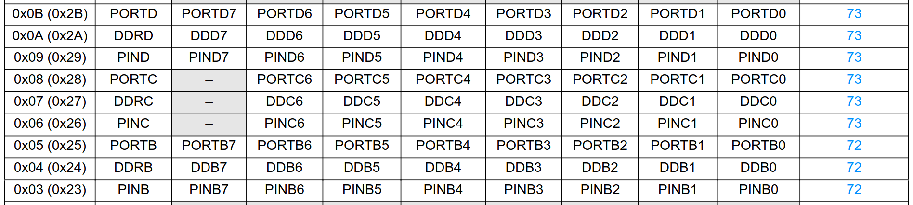
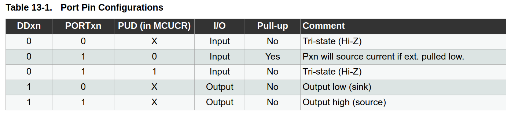

# 01 - Blink with `sbi` and `cbi`

This is the first hardware project in the series and the most basic.

The first arduino project every hobbyist and engineer ever makes, blinking an LED.

The goal is to blink the Arduino Nano built-in LED using AVR assembly and direct register control.

No Arduino libraries. No `digitalWrite()`. Just the ATmega328P registers.

## Hardware

- Arduino Nano/UNO/Pro Mini
- Built-in LED on D13 / PB5

No external components are needed.

## Registers used

Refer to the Datasheet of the ATMEGA328P chip.


```asm
.equ DDRB,  0x04
.equ PORTB, 0x05
.equ PB5,   5
```

## What these mean

`DDRB` is the Port B data direction register.

Each bit controls whether a Port B pin is an input or output:

- `0` = input
- `1` = output

`PORTB` controls the output state of Port B pins.

For an output pin:

- `0` = `LOW`
- `1` = `HIGH`

The Arduino Nano built-in LED is connected to `PB5`, which is Arduino digital pin `D13`. Refer to your specific Arduino pinout diagrams provided in the docs.

## Pin Configurations

According to the datasheet of the ATMEGA328P, if we want to set a pin as output we have to set the pin in DDRx as 1 or HIGH, and to output 1 or 0 we have to set the pin in PORTx to 1 or 0.
/

## Core idea

```asm
sbi DDRB, PB5
```

`sbi` means set bit in I/O register.

This sets bit `5` of `DDRB`, making `PB5` an output.

```asm
sbi PORTB, PB5
```

This sets bit `5` of `PORTB`, driving `PB5` `HIGH` and turning the LED on.

```asm
cbi PORTB, PB5
```

`cbi` means clear bit in I/O register.

This clears bit `5` of `PORTB`, driving `PB5` `LOW` and turning the LED off.

## Delay loop

The delay is a simple software delay.

It uses three counters:

- `r18`
- `r19`
- `r20`

The CPU counts down repeatedly to waste time.

This is not an accurate timer. It is just enough delay to make the LED blink visibly.

Later lessons will replace this with hardware timers.

## Build

```bash
make
```

## Upload

```bash
make upload
```

If your Arduino Nano appears on a different port:

```bash
make upload PORT=/dev/ttyACM0
```

If your Nano uses the old bootloader:

```bash
make upload BAUD=57600
```

## Disassemble

```bash
make disasm
```

This shows the actual instructions that were generated. When trying this on your own, check out what the assembler outputs compared to what you wrote. It will all make sense later.

## What I learned

- How to set a pin as output using `DDRB`
- How to control an output pin using `PORTB`
- How `sbi` and `cbi` work only modifying single bits
- How labels and loops work in AVR assembly
- How a basic software delay loop works
- How to build and upload AVR assembly from Linux
